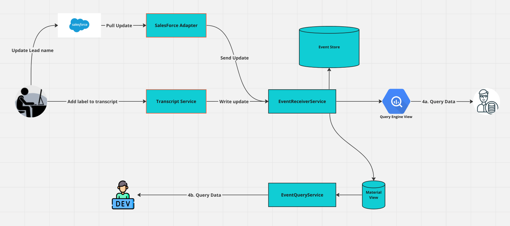
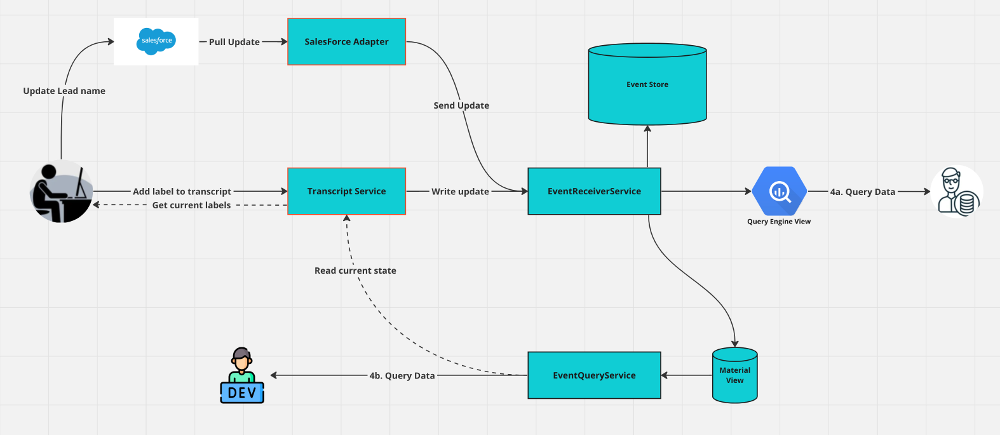

# <u>Writing Adapters</u>

The adapters are components responsible for extracting data and sending them to the Event Receiver Service. The adapter determines the structure of your entities and describes them explicitly, so they are understood downstream.

The steps are generally as follows:
1. Pull the raw data from your external source
2. Rename and restructure your data.
3. Transform into the [YADTO](/dreampipe/yadto/YADTO.md) format. (This can be performed using a DreamPipe library)
4. Send the YADTO data to the ERS.


## <u>A working example</u>
For example, you may have pulled the following update from Salesforce for a Lead.
<details>
<summary><b>Expand to view JSON for Lead</b></summary>

```json
{
    "attributes": {
        "type": "Lead",
        "url": "/services/data/v52.0/sobjects/Lead/00Q8G0000321321321"
    },
    "Id": "00Q8G0000321321321",
    "IsDeleted": false,
    "LastName": "lastName",
    "FirstName": "firstName",
    "Name": "firstName lastName",
    "Company": "My Company",
    "Country": "United States",
    "Address": {
        "city": "Miami",
        "country": "United States",
        "geocodeAccuracy": null,
        "latitude": null,
        "longitude": null,
        "postalCode": "12345",
        "state": null,
        "street": "123 Fake Street"
    },
  "Phone": "456",
  "MobilePhone": "2345",
  "Email": "myEmail@FakeEmail.com",
  "PhotoUrl": "/services/images/photo/00Q8G0000321321321",
  "LeadSource": "Television Ads",
  "Status": "Protected",
  "OwnerId": "0058G0000123123123",
  "HasOptedOutOfEmail": false,
  "IsConverted": false,
  "ConvertedDate": null,
  "IsUnreadByOwner": false,
  "CreatedDate": "2023-10-27T13:41:08.000+0000",
  "LastModifiedDate": "2024-03-05T21:26:12.000+0000"
}
```
</details>

You may wish to pull in a subset of this data, and change the key values to your own internal naming convention. In Java, we can take a subset of the fields, and even include some nested fields from the Address object, and move them to a flat structure. 

<details> 
<summary><b>Expand to see Java Example</b></summary>

```java
public SalesforceDreamPipeLead transformJson(String jsonInput) {
    SalesforceLead salesforceLead = new ObjectMapper().readValue(jsonInput, SalesforceLead.class);
    SalesforceDreamPipeLead salesforceDreamPipeLead = SalesforceDreamPipeLead.builder()
                    .leadPhone(salesforceLead.getPhone())
                    .email(salesforceLead.getEmail())
                    .city(salesforceLead.getAddress().getCity())
                    .country(salesforceLead.getAddress().getCountry())
                    .createdOn(salesforceLead.getCreatedDate())
                    .timestamp(salesforceLead.getLastModifiedDate())
                    .build();
    
    return salesforceDreamPipeLead;
}

@Data
@JsonIgnoreProperties(ignoreUnknown = true)
class SalesforceLead {
    private String Phone;
    private String Email;
    private Date CreatedDate;
    private Date LastModifiedDate;
    private Address Address;
}

@Data
@JsonIgnoreProperties(ignoreUnknown = true)
class SalesforceAddress {
    private String city;
    private String country;
}

@Data
@Builder
class SalesforceDreamPipeLead {
    private String leadPhone;
    private String email;
    private String city;
    private String country;
    private Date createdOn;
    private Date timestamp;
}
```
</details>

Now we will add a step that will transform it into a DreamPipe payload, ready to send to the Event Receiver Service.

<details> 
<summary><b>Expand to see Java Example</b></summary>

```java
public Map<String, EntityPropertyValue> transformJson(String jsonInput) {
    SalesforceLead salesforceLead = new ObjectMapper().readValue(jsonInput, SalesforceLead.class);
    SalesforceDreamPipeLead salesforceDreamPipeLead = SalesforceDreamPipeLead.builder()
                    .leadPhone(salesforceLead.getPhone())
                    .email(salesforceLead.getEmail())
                    .city(salesforceLead.getAddress().getCity())
                    .country(salesforceLead.getAddress().getCountry())
                    .createdOn(salesforceLead.getCreatedDate())
                    .timestamp(salesforceLead.getLastModifiedDate())
                    .build();

    Map<String, EntityPropertyValue> dreamPipePayload = DreamPipePayload.builder()
            .payload(campaignSnapshot)
            .eventSource("myOrganization/salesforce-adapter") // eventSource is currently a required field
            .eventVersion("1.0.0") // eventVersion is optional, you can use this for your own tracking of your object schema if you wish
            .build();
    return dreamPipePayload;
}

@Data
@JsonIgnoreProperties(ignoreUnknown = true)
class SalesforceLead {
    private String Phone;
    private String Email;
    private Date CreatedDate;
    private Date LastModifiedDate;
    private Address Address;
}

@Data
@JsonIgnoreProperties(ignoreUnknown = true)
class SalesforceAddress {
    private String city;
    private String country;
}

@Data
@Builder
class SalesforceDreamPipeLead {
    private String leadPhone;
    private String email;
    private String city;
    private String country;
    private Date createdOn;
    private Date timestamp;
}
```
</details>

Your data is now ready to send to the Event Receiver Service!

## <u>Writing data directly into DreamPipe</u>

You may have a webservice that generates data and wish to store it in DreamPipe directly. At Origin8, we unify our external and internal sources of data so that our architecture is the same for both. This allows us to replace third party tool functionality with our own seamlessly when we're ready. It also allows us to change vendors easily.

Below is an example of an architecture where two sources are unified. An end user updates a Lead in Salesforce, for example, they update their name and date of birth. The user also adds a label to a transcript of a phone call that occurred for this lead.

Transcript Service has its own web UI which the end user interacts with. It also writes the updates directly to the ERS. There's no database attached directly to the Transcript Service.

In this example the end user adds a label to a transcript of a phone call, and then updates the Lead's name in Salesforce. You can see how the information quickly flows into the same path. And when we read the data, we use the same approach regardless of where the data was originally sourced from.
<<<<<<< Suggestion: Is the Transcript service different from an any other Adapter? Is there a difference between Send Update and Write Update? If not then I would suggest using same terminology for simplicity 
<<<<<<< Suggestion: In the diagram, maybe rename `Transcript Service` to ` Transcript Adapter` for the sake of clarity


The Transcript Service can then read the current state from the Event Query Service as illustrated below: 
