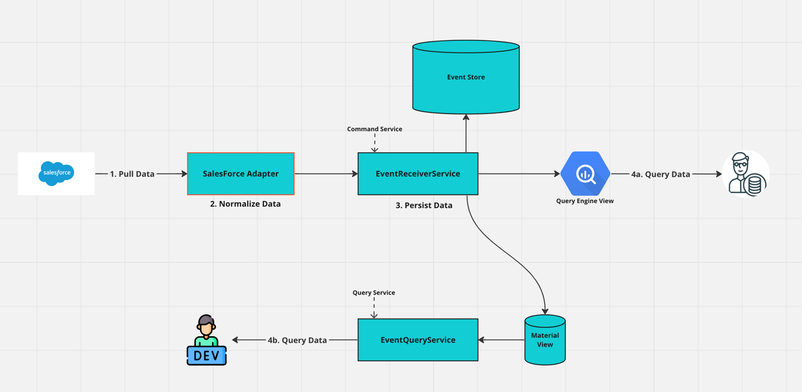

# <u>DreamPipe</u>

DreamPipe is a customizable [Event Sourced](https://learn.microsoft.com/en-us/azure/architecture/patterns/event-sourcing) Data Pipeline framework. It allows you to transform any data source into an Event Sourced database. It provides a framework for implementing CQRS with minimum setup and maintenance. This lets the developers focus on the business logic. 

## <u>How does it work?</u>

In a regular [CQRS pattern](https://learn.microsoft.com/en-us/azure/architecture/patterns/cqrs), you need to create your Command Service, and your Query Service. DreamPipe abstracts these concepts and exploits configuration rather than code to make bootstrapping your services as quick as possible.

Below is an example architecture for a CQRS pattern where we wish to extract data from Salesforce. 

This architecture takes data from an external provider (in this case, Salesforce) and stores it as Event Sourced data. It then provides read only views which are accessible by an SQL-like query engine and by API. 

In this example, the flow is as follows:
1. The Salesforce Extractor calls the Salesforce API and retrieves some customer data. 
2. The Salesforce Adapter normalizes the data and submits it to the Event Receiver Service (ERS). 
3. The ERS then checks if the event contains new information, and if so, stores a new event in the event store.
4. The relevant views are updated.

If one were to develop this from scratch, it would take a considerable amount of time. With DreamPipe, it will be substantially quicker!

### <u>The Producers</u>
The producers need to normalize your data. You do not want to be constrained by your external providers API names for your entities. You also want to be decoupled from their data structures. These producers are small layers that interpret the data and transform it into a DreamPipe format. This conversion is made easy with the use of DreamPipe's libraries.  

Once the conversion is complete, it's time to pass the event onto the Event Receiver Service.

It's important to note that you can also store your own data directly into DreamPipe. If you were to write your own CRM system, you would use DreamPipe as your Database. This helps to unify your architecture between external and internal data sources.

For more information, see the section on [Writing your Adapter](/dreampipe/producers/producers)

### <u>The Event Receiver Service (ERS)</u>
The Event Receiver Service is the most crucial component of the architecture. It receives updates and makes sense of the history of your entity. It understands the rules of your entities with configurations instead of code. By doing so, it makes adding new entities to your pipeline easy. It is the equivalent of your Command Service in the CQRS architecture.

DreamPipe provides a library that bootstraps your own Event-Receiver-Service in minutes. And then you add a simple entity configuration.

### <u>The Event Query Service (EQS) </u>
The Event Query Service is the partner to the ERS. It makes sense of how to read the event sourced data. Again, DreamPipe provides libraries that help you bootstrap a service that will provide all sorts of read capabilities to your data.

### <u>The Event Store</u>
This is your single source of truth for your domain. It is an immutable source of information and contains your change history of your entities.

### <u>The Query Engine</u>
The Query Engine uses Google's BigQuery to read through your data. It is ideal for Data Scientists and Business Intelligence purposes as they can get a read-only view of your business domain in real time.

### <u>Material View</u>
This material view does a similar job for your developers as the Query Engine does for your Data Scientists. It allows an API accessible version of your data to be presented without risking it being modified incorrectly.

