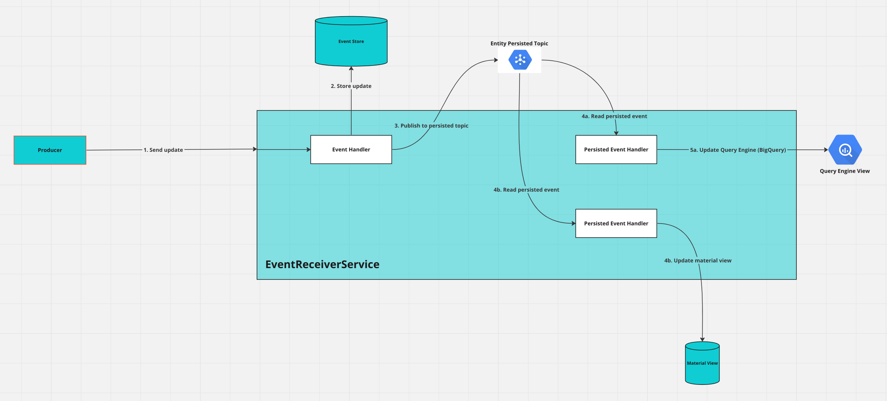

# The Event Receiver Service (ERS)

### Overview
The Event Receiver Service receives payloads from your event producers in the [YADTO](/dreampipe/yadto/YADTO.md) format. It will then process the update and store it in the Event Store.

The basic architecture for an ERS is as below

1. The event is first validated and processed by an Event Handler. 
2. If the event is valid and not a duplicate, it will persist the new update to the Event Store.
3. On a successful persistence, it will publish the event to the persisted topic.  
4. Two parallel Persisted Event Handlers will read this persistence event
5. One handler will update the query engine (5a), and the other will update any associated material views (5b).

### The Entity Persisted Topic

There exists an Entity Persisted Topic for each entity. It is used internally by the ERS, but the architecture enables other subscribers as well. This will