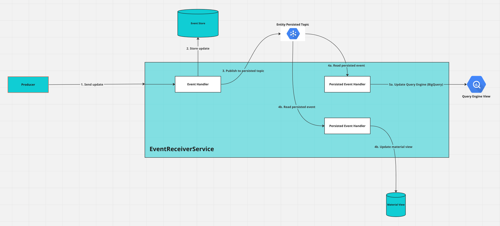

# The Event Receiver Service (ERS)

### How to bootstrap your own ERS
For a guide on building your own Event Receiver Service, see [here](/dreampipe/ers/boostrap_an_ers.md).

### Overview
The Event Receiver Service receives payloads from your event producers in the [YADTO](/dreampipe/yadto/YADTO.md) format. It will then process the update and store it in the Event Store.

The basic architecture for an ERS is as below

1. The event is first validated and processed by an Event Handler. 
2. If the event is valid and not a duplicate, it will persist the new update to the Event Store.
3. On a successful persistence, it will publish the event to the persisted topic.  
4. Two parallel Persisted Event Handlers will read this persistence event
5. One handler will update the query engine (5a), and the other will update any associated material views (5b).

### The Producer
The Producer is any component that sends data to the ERS. See the section on [producers](/dreampipe/producers/producers.md) for more details.

### The Event Store
The Event Store is a history of your entity updates. It uses [Google Firestore in Datastore mode](https://cloud.google.com/datastore/docs). It is a NoSQL database which allows our evolving schemas, while also having strong transactionality support.

### The Entity Persisted Topic
The topic is a [Google Cloud PubSub](https://cloud.google.com/pubsub) topic. There exists an Entity Persisted Topic for each entity. It is used internally by the ERS, but the architecture enables other subscribers as well. This enables hooking into DreamPipe and reacting to any updates you are interested in. All you need to do is create a [subscription](https://cloud.google.com/pubsub/docs/subscription-overview).

### The Query Engine
DreamPipe uses BigQuery to have a read-only SQL engine. It is intended for use by Data Scientists and Business Intelligence. DreamPipe updates BigQuery in real time which allows real-time querying, instead of waiting for batch jobs to consolidate the data.

The data inside is essentially a replica of the Event Store. But BigQuery provides more powerful methods to aggregate and inquire on your data.

### The Material View
The material view is a Firestore in Datastore mode that is intended to have a lighter, more consumable version of your entities than in the Event Store. If you use an Event-Query-Service, it will be backed by these Material Views. They are backed by the Event Store, and can be rebuilt easily by re-processing the Event Store.
